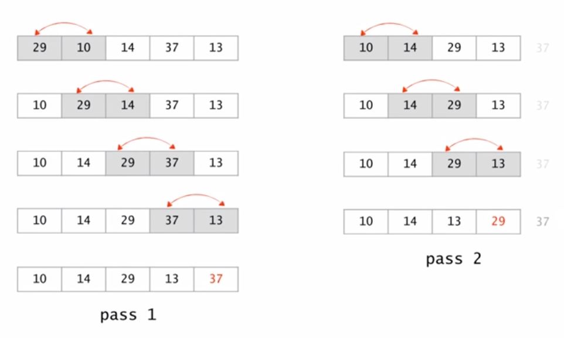
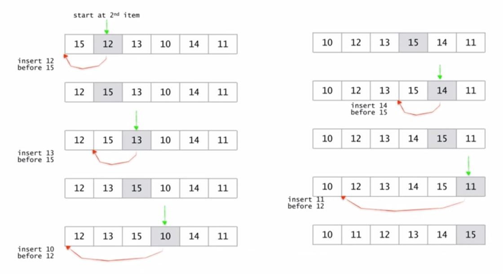
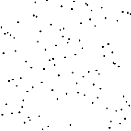
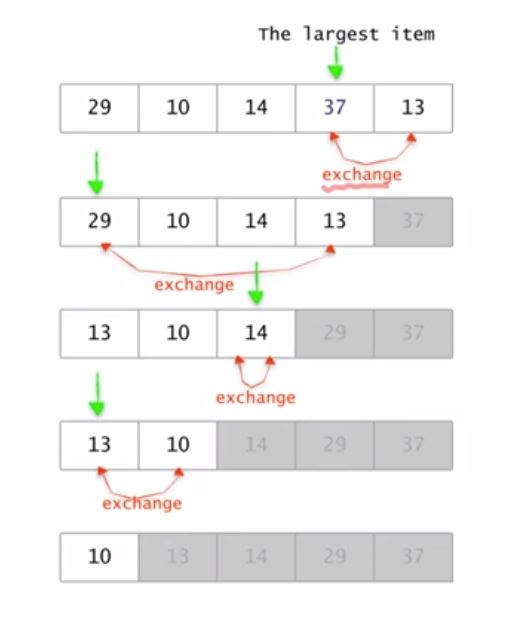
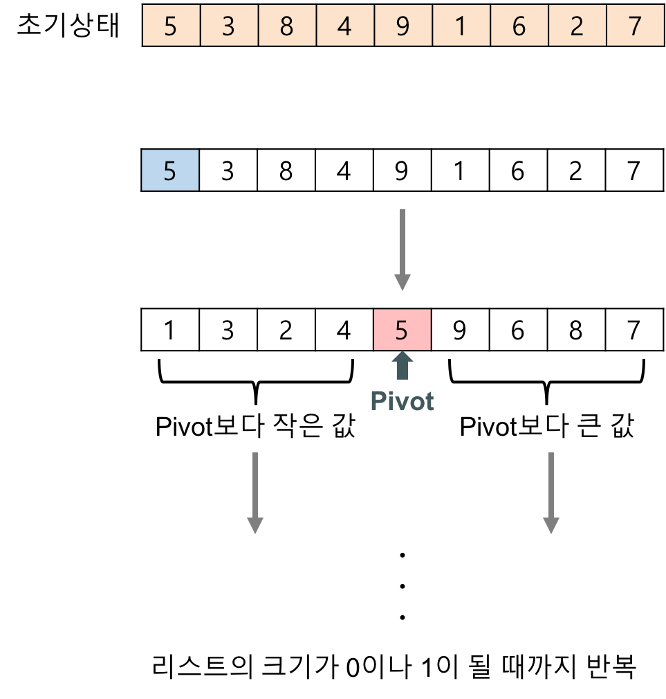

<div align=center>

# 3주차-정렬 알고리즘 구현

</div>

<br>

## 정렬 알고리즘
<table>
    <thead> 
    <tr> 
        <th>분류</th> 
        <th>알고리즘</th> 
    </tr> 
    </thead> 
    <tbody> 
    <tr> 
        <td rowspan=3>단순하지만 느림<br>O(n²)</td> 
        <td>거품 정렬(Bubble Sort)</td> 
    </tr> 
    <tr> 
        <td>삽입 정렬(Insertion) Sort)</td> 
    </tr> 
    <tr> 
        <td>선택 정렬(Selection Sort)</td>
    </tr> 
    <tr>
        <td rowspan=3>복잡하지만 빠름<br>O(n log n)</td>
        <td>퀵 정렬(Quick Sort)</td> 
    </tr> 
    <tr>
        <td>합병 정렬(Merge Sort)</td>
    </tr>
    <tr> 
        <td>힙 정렬(Heap Sort)</td>
    </tr> 
    <tr>
        <td>평균<br>O(n)</td>
        <td>라딕스 정렬(Radix Sort)</td> 
    </tr> 
    </tbody>
</table>

<hr>
<br>

## 거품 정렬
<div align=center>


</div>

<br>

- 각 루프 시 행동
  - 인접한 원소를 비교하여 큰 값을 오른쪽으로 이동시킨다.
  - 다음 회차 루프때 맨 왼쪽 원소를 제외한다.

- 루프의 시작이 맨 오른쪽이 될 때까지 반복한다.

<br>

<div align=center>



</div>

<hr>
<br>

## 삽입 정렬
<div align=center>


</div>

<br>

- 각 루프 시 행동
  - 시작회차 + 1의 위치 원소를 정렬된 배열과 비교한다.
  - 자신의 위치를 찾아 삽입한다.

- 루프의 시작이 맨 오른쪽이 될 때까지 반복한다.

<br>

<div align=center>



</div>

<hr>
<br>

## 선택 정렬
<div align=center>



</div>

<br>

- 각 루프 시 행동
  - 루프의 최대 원소를 찾는다.
  - 최대 원소와 맨 오른쪽 원소를 교환한다.
  - 맨 오른쪽 원소를 제외한다.

- 하나의 원소만 남을 때까지 위의 루프를 반복한다.

<br>

<div align=center>



</div>

<hr>
<br>

## 퀵 정렬
<div align=center>


</div>

<br>

- 임의의 pivot 값을 지정한다.

- 각 루프 시 행동
  - pivot 보다 큰 값을 pivot index 보다 왼쪽에서 찾아 큰 값이 나타날 때까지 i(index)를 증가시킨다.
  - pivot 보다 작은 값을 pivot index 보다 오른쪽에서 찾아 작은 값이 나타날 때까지 j(index)를 감소시킨다.
  - pivot 을 기준으로 값 비교가 완료되었다면 index 결과 i , j 를 비교한다.
  - i 값이 j 값보다 작거나 같다면 pivot 을 기준으로 교환을 해야 할 값이 존재한다는 뜻이다.
  - 값을 교환한 뒤 i 는 증가, j 는 감소시킨다.
  
- i 가 j 보다 클 때까지 반복한다.

<br>

## 분할-정복(Divide and Conquer) 알고리즘이란?
- 해결하기 힘든 주 문제를 부 문제로 분할하여 해결하는 방법

- 보통 재귀 함수(Recursive Function)로 구현
  - 부 문제로 분할하여 적용할 알고리즘은 임의로 선택 가능
  - 재귀 호출을 사용한 함수는 함수 호출 오버헤드 때문에 실행 속도 감소
  - 빠른 실행이나 부 문제 해결 순서 선택을 위해 재귀 호출이 아닌 스택(Stack), 큐(Queue) 등의 자료구조를 이용하여 분할 정복법을 구현하는 것도 가능

- 의사코드 표현
    ```js
    function F(x):
    if F(x)의 문제가 간단 then:
        return F(x)을 직접 계산한 값
    else:
        x 를 y1, y2로 분할
        F(y1)과 F(y2)를 호출
        return F(y1), F(y2)로부터 F(x)를 구한 값
    ```

<br>

## 합병 정렬
<div align=center>


</div>

<br>

- 리스트의 길이가 1 이하이면 이미 정렬된 것으로 본다. 그렇지 않은 경우에는
- 분할(divide) : 정렬되지 않은 리스트를 절반으로 잘라 비슷한 크기의 두 부분 리스트로 나눈다.
- 정복(conquer) : 각 부분 리스트를 재귀적으로 합병 정렬을 이용해 정렬한다.
- 결합(combine) : 두 부분 리스트를 다시 하나의 정렬된 리스트로 합병한다. 이때 정렬 결과가 임시배열에 저장된다.
- 복사(copy) : 임시 배열에 저장된 결과를 원래 배열에 복사한다.

<br>

<div align=center>



</div>

<br>

## ~~힙 정렬~~(개념만 인지)
<div align=center>


</div>

<br>

1. n개의 노드에 대한 완전 이진 트리를 구성한다. 이때 루트 노드부터 부모노드, 왼쪽 자식노드, 오른쪽 자식노드 순으로 구성한다.
2. 최대 힙을 구성한다. 최대 힙이란 부모노드가 자식노드보다 큰 트리를 말하는데, 단말 노드를 자식노드로 가진 부모노드부터 구성하며 아래부터 루트까지 올라오며 순차적으로 만들어 갈 수 있다.
3. 가장 큰 수(루트에 위치)를 가장 작은 수와 교환한다.
4. 2와 3을 반복한다.

<br>

# 3주차 - 문제풀기(정렬)

# 3주차 - 과제(정렬)

<hr>
<br>

[뒤로가기](../curriculum.md)

<br>