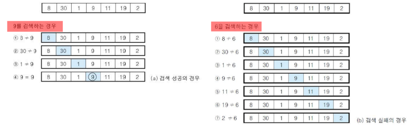
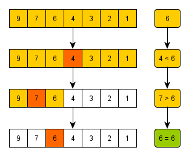

<div align=center>

# 4주차-검색 알고리즘 소개

</div>

<br>

## 검색 알고리즘
- 아이디를 모르는 한국인 동갑친구 A의 SNS를 찾는다고 가정해보자. 찾는 순서는 아래와 같다.
    ```
    1. 나라를 찾는다. 혹은 언어의 발음을 비교하여 한국인을 찾는다.
    2. 프로필 사진이 친구이거나 또래인 사람을 찾는다.
    3. 친구의 이름, 생년월일 등 친구인 것 같은 아이디를 찾는다.
    ```
    - 위와 같이 어떤 검색을 하여도 특정 항목에 주목하는 것은 '검색'의 특징이다.
    - 주목하는 항목을 '키(key)'라고 지칭하고, 검색 과정을 살펴보자.
        ```
        1. 키 값과 일치하도록 지정(국가)
        2. 키 값의 구간을 지정(또래의 나이대)
        3. 키 값과 비슷하도록 지정(친구가 사용할 것 같은 아이디)
        ```
    - 물론, 조건은 하나일 수도 있지만 여러 개일 수도 있다.

- 검색 기법에서의 몇몇은 자료구조에 의존한다. 스터디에서는 **배열의 검색**을 다룬다.

<br>

## 배열의 검색 종류
### 선형 검색
- 무작위로 늘어놓은 데이터 집합에서 검색 수행

### 이진 검색
- 정렬된 데이터 집합에서 빠른 검색 수행

### 해시법
- 추가, 삭제가 자주 일어나는 데이터 집합에서 빠른 검색 수행
  - 체인법 : 같은 해시 값의 데이터를 선형 리스트로 연결하는 방법
  - 오픈 주소법 : 데이터를 위한 해시 값이 충돌할 때 재해시하는 방법

<br>

## 선형 검색(Linear Search)
- 요소가 직선 모양으로 늘어선 배열에서의 검색
  - 원하는 키(조건) 값을 갖는 요소를 만날 때까지 맨 앞부터 순서대로 요소를 검색
  - 선형 검색(Linear Search) 또는 순차 검색(Sequential Search)이라고 함

<div align=center>



</div>

<br>

- 위의 예제로 보는 선형 검색의 종료 조건
  - 조건 1 : 검색할 값을 발견하지 못하고 배열의 끝에 도달한 경우(검색 실패)
  - 조건 2 : 검색할 값과 같은 요소를 발견한 경우(검색 성공)

- 실습
    ```java
    static int seqSearch()
    {
        // 검색 실패 시
        return -1;
    }
    ```

### 보초법
- 선형 검색의 종료 조건 검사 비용을 50%로 줄이는 방법
  - 검색하고자 하는 키 값을 맨 끝 요소에 저장
  - 이 경우 조건 1을 검사하지 않고 조건 2만 검사

- 실습
    ```java
    static int seqSearchSen()
    {
        // 검색 실패 시
        return -1;
    }
    ```

<br>

## 이진 검색(Binary Search)
- 요소가 오름차순 또는 내림차순으로 정렬된 배열에서 적용하는 검색 알고리즘

<div align=center>



</div>

<br>

- 위의 예제로 보는 이진 검색의 종료 조건
  - 조건 1 : 검색 범위가 더 이상 없는 경우(검색 실패)
  - 조건 2 : 검색할 값과 배열의 중앙 값이 일치하는 경우(검색 성공)

- 실습
    ```java
    static int binSearch()
    {
        // 검색 실패 시
        return -1;
    }
    ```

<br>

## 선형 검색과 이진 검색의 비교
<div align=center>


</div>

<br>

### 선형 검색의 시간 복잡도(Time Complexity)
- 코드
    ```java
    static int seqSearch(int[] n, int t)
    {
        int i = 0;                                  // 1
        while(i < n.length)                         // 2
        {
            if(n[i] == t)                           // 3
            {
                // 검색 성공
                return i;                           // 4
            }

            i++;                                    // 5
        }
        // 검색 실패
        return -1;                                  // 6
    }
    ```

- 선형 검색에서의 각 단계 실행 횟수와 복잡도

    |단계|실행 횟수|복잡도|
    |----|---------|------|
    |1|1|O(1)|
    |2|n/2|O(n)|
    |3|n/2|O(n)|
    |4|1|O(1)|
    |5|n/2|O(n)|
    |6|1|O(1)|

    ```
    O(1) + O(n) + O(n) + O(1) + O(n) + O(1) = O(max(1,n,n,1,n,1)) = O(n)
    ```

<br>

### 이진 검색의 시간 복잡도(Time Complexity)
- 코드
    ```java
    static int binSearch(int[] n, int t)
    {
        // 검색 범위의 시작(처음) 인덱스
        int start = 0;                              // 1
        // 검색 범위의 종료(끝) 인덱스
        int end = n.length -1;                      // 2

        do
        {
            // 중앙 요소의 인덱스
            int center = (start+end) / 2;           // 3
            
            if(n[center] == t)                      // 4
            {
                // 검색 성공
                return center;                      // 5
            }
            else if(n[center] < key)                // 6
            {
                // 검색 범위를 뒤쪽 반으로 좁힌다.
                start = center + 1;                 // 7
            }
            else{
                // 검색 범위를 앞쪽 반으로 좁힌다.
                end = center -1;                    // 8
            }
        }
        while(start <= end);                        // 9

        // 검색 실패
        return -1;                                  // 10
    }
    ```

- 이진 검색에서의 각 단계 실행 횟수와 복잡도

    |단계|실행 횟수|복잡도|
    |----|---------|------|
    |1|1|O(1)|
    |2|1|O(1)|
    |3|log n|O(log n)|
    |4|log n|O(log n)|
    |5|1|O(1)|
    |6|log n|O(log n)|
    |7|log n|O(log n)|
    |8|log n|O(log n)|
    |9|log n|O(log n)|
    |10|1|O(1)|

    ```
    O(1) + O(1) + O(log n) + ... + O(1) = O(log n)
    ```

<br>

### Big-O 의 대소 관계
<div align=center>

**`O(1)`** < **`O(log n)`** < **`O(n)`** < **`O(n log n)`** < **`O(n²)`** < **`O(2ⁿ)`** < **`O(n!)`** < **`O(nⁿ)`**

</div>

<hr>
<br>

# 4주차 - 문제(검색)
- 

<hr>
<br>

[뒤로가기](../curriculum.md)

<br>